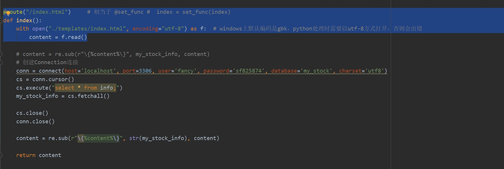
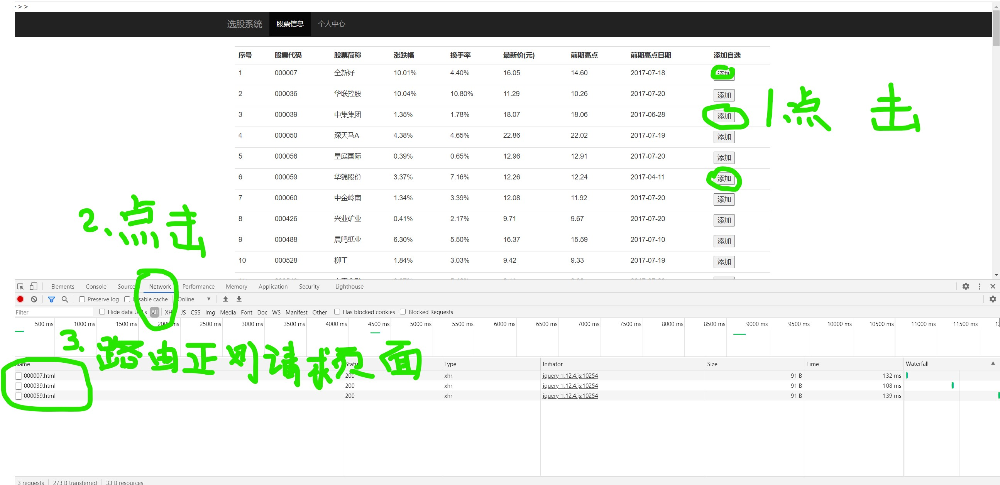

- version 1.0

    多进程面向对象web服务器
    
- version 1.1

    静态资源，动态资源web服务器
    
- version 1.2

    服务器支持WSGI
    
- version 1.3

    服务器支通过字典将需要的参数传递给`miniframe`   
    
- version 2.0

    `miniframe`获取页面模板数据，对代码结构进行了划分：static和dynamic
    
- version 2.1

    实现了模板中数据简单替换的功能

- version 2.2

    web服务器程序接收命令行参数
    实现了web服务器时指定端口、指定对应的框架（mini_frame）
    
- version 2.3

    增加了web服务器对于配置文件的支持

- version 2.4

    增加了路由功能（装饰器实现）
 
- version 2.5

    服务器支持伪静态

- version 2.6 
    
    1.增加了从mysql数据库查询的功能
    2.python在windows平台上打开文档时，将编码转换成utf-8

 
 - version 2.7
    
    组装mysql数据库查询的结果为html格式，使数据显示规范化
    
- version 3.0

    实现路由支持正则功能
    
 ```py
@route(r"/add/\d+\.html")
def add_focus():
    return "add ok ...."
```


- version 3.1

    实现了添加关注的功能:通过正则分组将股票代码从添加生成的url中提取出来，然后mysql查询，将符合条件的股票代码项插入focus数据表
